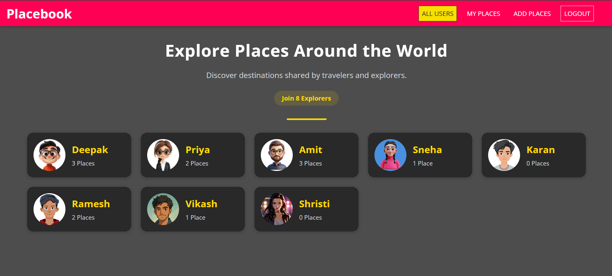
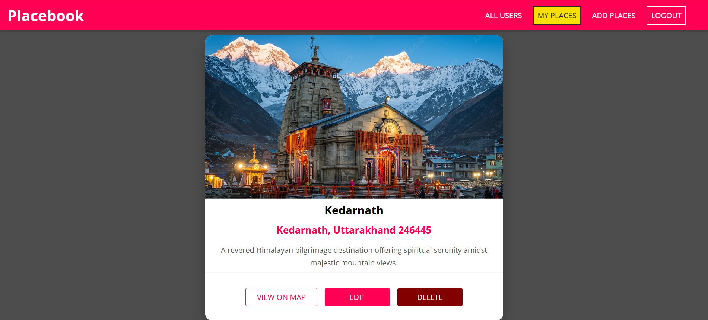

# PlaceBook

### A Full-Stack Social Travel Platform

PlaceBook is a full-stack MERN application that allows users to discover, share, and manage memorable places. Users can create personal profiles, upload images, add destinations with location details, and explore places shared by the community through a modern and responsive interface.

The project demonstrates a production-oriented architecture with secure authentication, cloud-based image storage, geolocation services, and full-stack deployment.

---

## Live Demo

- **Application:** [https://placebook-inky.vercel.app](https://placebook-inky.vercel.app)
- **Backend API:** [https://placebook-server-zylt.onrender.com/api](https://placebook-server-zylt.onrender.com/api)
- **Backend Source Code:** [https://github.com/deepak11-tech/placebook-server](https://github.com/deepak11-tech/placebook-server)

---

## Application Preview

### Home Page



### My Places



---

## Key Features

### Authentication & User Management

- User registration with profile image upload.
- Secure login using JWT authentication.
- Password encryption using bcrypt.
- Protected routes for authenticated users.
- User-specific permissions and ownership validation.

### Place Management

- Create and publish new places.
- Upload place images and descriptions.
- View places shared by different users.
- Edit existing place information.
- Delete places securely.
- Interactive map modal for every location.

### Cloud Image Management

- Cloudinary integration for image storage.
- Persistent cloud-based media hosting.
- Automatic cleanup of images when places are deleted.
- Automatic removal of uploaded images if place creation fails.
- Image upload validation and size restrictions.

### Location Services

- Address-to-coordinate conversion.
- Geolocation validation before saving places.
- Interactive map visualization.

### User Experience

- Responsive design for desktop and mobile.
- Modern card-based interface.
- Loading indicators and asynchronous request handling.
- Error handling with user-friendly feedback.
- Confirmation dialogs for destructive actions.

---

## Technology Stack

| Category        | Technologies                               |
| --------------- | ------------------------------------------ |
| Frontend        | React.js, React Router, Custom Hooks, CSS3 |
| Backend         | Node.js, Express.js                        |
| Database        | MongoDB Atlas, Mongoose                    |
| Authentication  | JWT, bcrypt.js                             |
| Image Storage   | Cloudinary, Multer                         |
| APIs            | REST API, Geocoding API                    |
| Deployment      | Vercel, Render                             |
| Version Control | Git & GitHub                               |

---

## Local Development Setup

### Prerequisites

Make sure the following are installed:

- Node.js
- npm
- Git
- MongoDB Atlas account
- Cloudinary account

### 1. Clone the Frontend Repository

```bash
git clone YOUR_FRONTEND_REPOSITORY_URL
cd placebook
```

### 2. Install Frontend Dependencies

```bash
npm install
```

### 3. Clone the Backend Repository

```bash
git clone YOUR_BACKEND_REPOSITORY_URL
cd placebook-server
npm install
```

### 4. Configure Environment Variables

#### Frontend (`.env`)

```env
REACT_APP_BACKEND_URL=http://localhost:5000/api
```

#### Backend (`.env`)

```env
MONGODB_URI=your_mongodb_connection_string
JWT_KEY=your_jwt_secret_key
CLOUDINARY_CLOUD_NAME=your_cloudinary_name
CLOUDINARY_API_KEY=your_cloudinary_api_key
CLOUDINARY_API_SECRET=your_cloudinary_api_secret
```

### 5. Start the Backend Server

```bash
cd placebook-server
npm start
```

The backend will be available at:

```text
http://localhost:5000
```

### 6. Start the Frontend Application

Open a new terminal window and run:

```bash
cd placebook
npm start
```

The frontend will be available at:

```text
http://localhost:3000
```

---

## Repository Structure

```text
placebook/
│
├── public/
├── src/
│   ├── places/
│   ├── users/
│   ├── shared/
│   └── App.js
│
├── assets/
│   ├── home.png
│   ├── add-places.png
│
├── package.json
└── README.md
```

The backend is maintained as a separate repository and can be found here:

- **Placebook Server:** [https://github.com/deepak11-tech/placebook-server](https://github.com/deepak11-tech/placebook-server)

---

## Project Architecture

```text
                     React Frontend
                            │
                            │
                    RESTful HTTP APIs
                            │
                            ▼
                  Node.js + Express.js
                            │
                ┌───────────┴───────────┐
                │                       │
                ▼                       ▼
        MongoDB Atlas            Cloudinary
         Data Storage           Image Storage
```

---

## Security & Reliability

- JWT-based authentication and authorization.
- Password hashing using bcrypt.
- Protected API endpoints.
- Ownership validation for updates and deletions.
- Environment variable management for sensitive credentials.
- Cloud-based image persistence.
- Automatic cleanup of orphaned image uploads.
- File upload validation and robust error handling.

---

## Author

**Deepak Kumar Chaudhary**

If you found this project interesting or helpful, consider giving the repository a star. Feedback and suggestions are always welcome.
